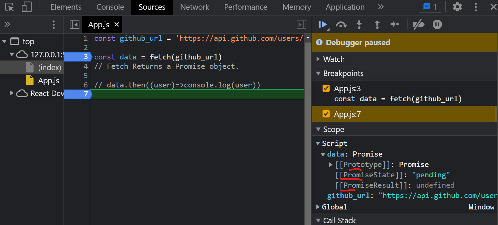
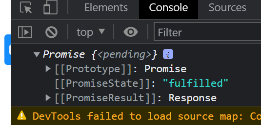

# Namaste-Javascript

[Callbacks](#callbacks) 

[1. Callback Hell](#1-callback-hell)

[2. Inversion of Control](#2-inversion-of-control)

[Promises](#promises)

[Fetch Data from API](#fetch-data-from-api)

[Promise - Interview Questions](#promise---interview-questions)

[Promise Chaining in JavaScript](#promise-chaining-in-javascript)


## Callbacks

- Callback are powerful way of handling asynchronous operations in javascript.

- 2 Issues with callbacks

    1. Callback Hell
    2. Inversion of Control

## 1. Callback Hell

### Example - 1

```js
console.log('Namaste')

console.log('Javascript')

console.log('Season 2')
```

Above codes will be logged soon on console. Suppose we want to run second console after 5 seconds. For that, we create a callback function and wrap the console in the same. Then we wrap the whole function in a `setTimeout` and set the time of 5 seconds.

### Example - 2 / Ecommerce Real World

Order of Execution should be as follows:

1. Create an Order
2. Proceed to Payment
3. Show order summary page
4. Update the wallet only after showing the order summary

```js
const cart = ['shoes', 'pants', 'shorts']

api.createOrder(cart, function () {
    api.proceedToPayment(function(){
        api.showOrderSummary(function(){
            api.updateWallet()
        })
    })
});
```

- We wrap proceedToPayment api inside createOrder api. 
- And inside the proceedToPayment api, we wrap the showOrderSummary api.
- We wrap the updateSummary api inside showOrderSummary api to finally show the updated wallet.
- But this creates a **callback hell**.

### What is a callback hell ?

- One callback inside another callback inside another callback will makes this `callback hell`. This kind of code structure is `unreadable` and `unmaintable`. This structure is also called as `Period of Doom`.

## 2. Inversion of Control

Means we lose the control over our code. Whenever we pass our callback function inside another callback, we are giving the control of our piece of code to some other code and we dont know what happens behind the scenes. This is the problem we face when we use callbacks.


## Promises

https://www.youtube.com/watch?v=ap-6PPAuK1Y


- Promises are used to handle async operations in jaavscript.

### Previous Way of handling async operation

```js
const cart = ['shoes', 'pants', 'shorts']

createOrder(cart, function(orderId) {
    proceedToPayment(orderId)
});
```

- Responsibility of `createOrder` api is to create an order first and then call our callback function back once the order is created.

- We know that, problem here is the *inversion of control* that is passing the control of our code to some other code.

- To solve this, we dont take callback function inside `createOrder` API, Instead we use Promises to implement asynchronous operations.

```js
const promise = createOrder(cart);
```

- When above code executes, `createOrder` API returns a promise.

- `Promise` is an empty object.

- After some seconds, this promise object is filled with data returned by `createOrder` API.

- Once we get the data, we attach the callback function to this promise object using `then` method.

- This `callback` function is automatically called once we get the data.

```js
promise.then((orderId)=>{
    proceedToPayment(orderId)
})
```

### Why use Promises instead of older way ?

- Because in earlier case, we were passing a `callback` function to another function, but 
in promises we were attaching callback function to the promise object.

- In previous case, we passed the function and `createOrder` api might have called it whenever it wants to.

- In case of promise, `creatOrder` API is called and fills the `promise` object with data.

- As soon as the `promise` object is filled with the data, it will automatically call the `callback` function.

- Thus we have the control over program with us. `Promise` gives the guarantee that it will call the callback function when promise object is filled with data. Also we are not passing our code to some other functions.

## Fetch Data from API


```js
const github_url = 'https://api.github.com/users/jisshub'

const data = fetch(github_url) 
```

- `fetch` returns a promise object.




- From the above image, we know promise has 3 objects inside it.
    
    1. **Prototype**
    2. **PromiseState**
    3. **PromiseResult**

- Right now promise is in a `pending` state because data not fetched yet. It takes some time to get the data from the API. This is why state is shown as `pending` at the start.
- `PromiseResult` will store whatever data the `fetch` method returns. Initially it will be set as `undefined`.


```js
const github_url = 'https://api.github.com/users/jisshub'

const data = fetch(github_url) 

console.log(data)
```
- `PromiseState` will gives you the state that promise is currently in. Once data is fetched, `PromiseState` changes to `fullfilled` state.

- `PromiseResult` will now returns a `Reponse` object. This contains the actual data. To extract the data, we have to convert it to JSON format.



- Next we attach a callback function using `then` method into a `promise` to store the data into a user object.

```js
const github_url = 'https://api.github.com/users/jisshub'

const data = fetch(github_url) 

data.then((user)=>console.log(user))
```

### Other Features of Promise

- The promise object can only be resolved once. either it is a success or failure.

- State can be only 3 in a promise.
    1. pending
    2. fulfilled
    3. rejected

- Promise object are immutable meaning it cannot be edited/updated.


## Promise - Interview Questions

1. What is a Promise ?

- A `promise` is an object representing the eventual completion of an `asynchronous` operation.

        Object + eventual completion + async operation


## Promise Chaining in JavaScript

Promise chaining is used to handle the callback hell.

```js
const cart = ['shoes', 'shirts', 'jeans']

createOrder(cart, function (orderId) {
    proceedToPayment(orderId, function (paymentInfo) {
        showOrderSummary(paymentInfo, function () {
            updateWalletBalance(function () {
            })
        })
    })
});
```

Above code causes a callback hell.

### Solution to Callback Hell

```js
createOrder(cart)
    .then((orderId)=>{
        return proceedToPayment(orderId)
    })
    .then((paymentInfo)=>{
        return showOrderSummary(paymentInfo)
    })
    .then(()=>{
        return updateWalletBalance()
    })
```

Attach a callback function to the response we get from each promise using `then` method.

This is called `Promise Chaining` which will get us out from `callback hell`.


## Creating a Promise, Chaining & Error Handling 

https://www.youtube.com/watch?v=U74BJcr8NeQ

Consider an e-commerce application with cart items,

```js
const cart = ['shoes', 'pants', 'khurtas']
```

1. First step is to create an order. So we run a `createOrder` API. This API returns a promise object.

```js
const promise = createOrder(cart)
```

2. Later on, we attach a callback function to promise object which in turn calls `proceedToPayment` API.

```js
promise
    .then((orderId)=>proceedToPayment(orderId))
```

3. Next create a function for `createOrder` that returns a promise.

4. Inside this function, we create a new promise constructor using `new` and `Promise` keyword. Promise takes a function which has 2 parameters: `resolve` and `reject`. They are given by javascript to build the promises.

5. Inside the promise constructor, we perform some functionalities like, create order, validating our cart, etc... If any of these fails, Promise is rejected or returns failed state.

6. For example, consider a functionality to validate the cart. If the cart is not valid, we call `reject()` and throws some error in it. Here promise is `rejected`. 

7. Consider a case if `orderId` is valid or not. If orderId is valid, we call `resolve()` and pass `orderId`. Here promise is `resolved`.

8. Finally whatever the output is either success or failure, `promise` is returned at the end.

**Example:**

```js
function createOrder() {
    const pr = new Promise((resolve, reject)=>{
        if(!validateCart(cart)) {
            const err = new Error('Cart is not valid')
            reject(err)
        }  
        
        const orderId = '12345';
        if (orderId) {
            resolve(orderId)
        }
    })

    return pr
}
```

This how a promise is created.


8. Run the full code.

```js
const cart = ['shoes', 'shirts', 'jeans']

const promise = createOrder(cart)

// attach callback to promise to get data
promise
    .then((orderId)=> {
        console.log(orderId)
    }
)

function validateCart(cart) {
    return true;
}

// create a function for createOrder API to return a promise.
function createOrder() {
    const pr = new Promise((resolve, reject)=>{
        if(!validateCart(cart)) {
            const err = new Error('Cart is not valid')
            reject(err)
        }  
        
        const orderId = '12345';
        if (orderId) {
            resolve(orderId)
        }
    })

    return pr
}

```


<!-- time: 12:15 -->


