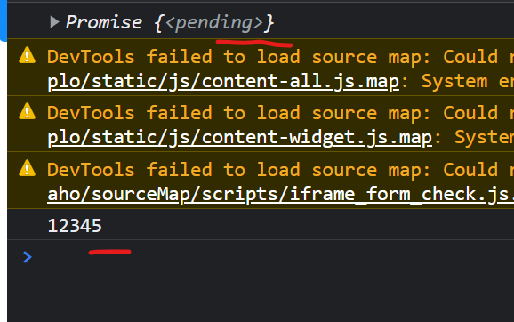
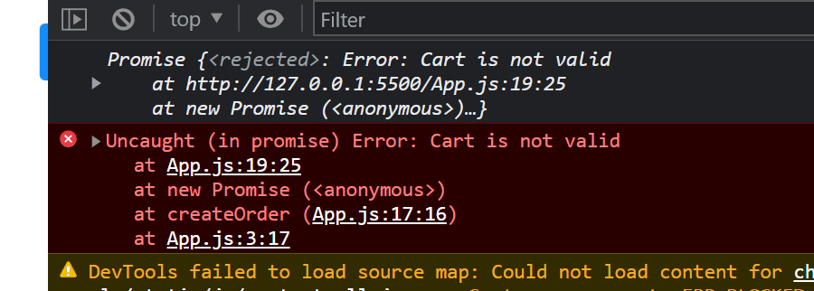
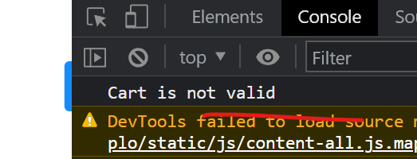
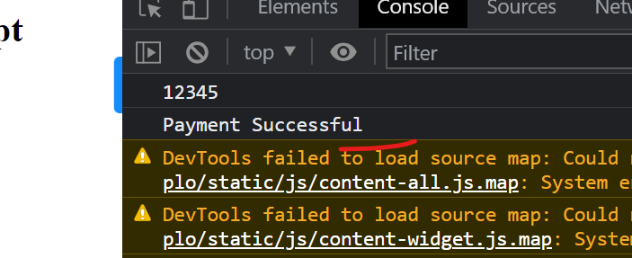
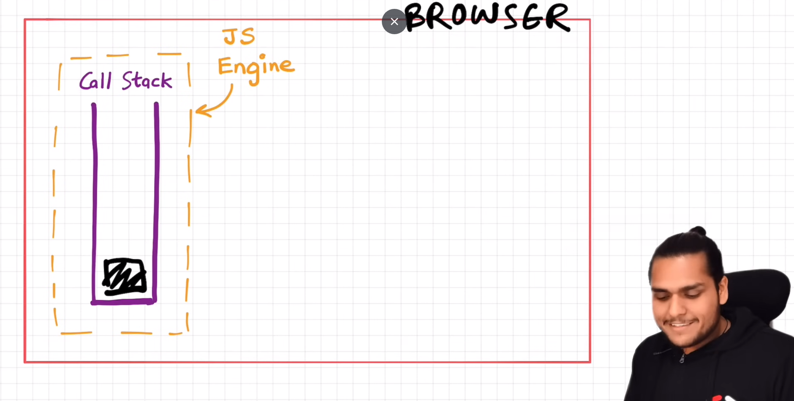
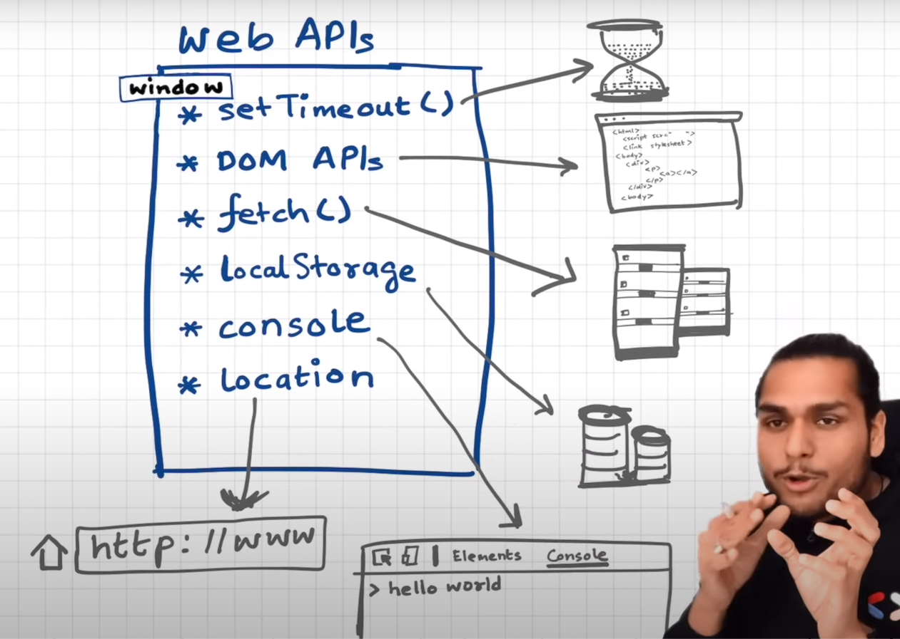
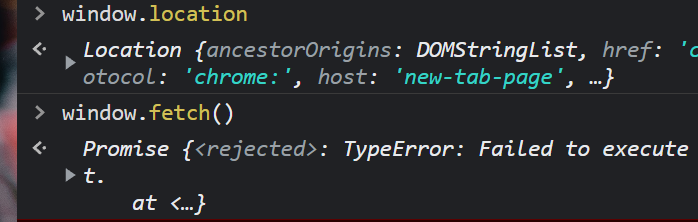
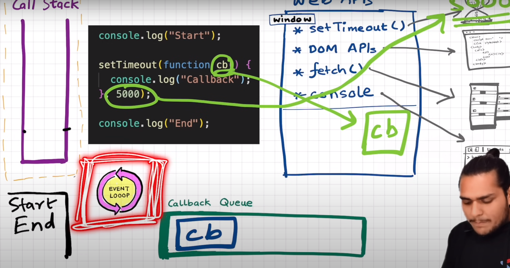

# Namaste-Javascript

[Callbacks](#callbacks) 

[1. Callback Hell](#1-callback-hell)

[2. Inversion of Control](#2-inversion-of-control)

[Promises](#promises)

[Fetch Data from API](#fetch-data-from-api)

[Promise - Interview Questions](#promise---interview-questions)

[Promise Chaining in JavaScript](#promise-chaining-in-javascript)

[Creating a Promise, Chaining & Error Handling](#creating-a-promise-chaining--error-handling)

[Promise Resolve](#promise-resolve)

[Promise Reject](#promise-reject)

[Error Handling in Promise](#error-handling-in-promise)

[Promise Chaining](#promise-chaining)

[Advanced Error Handling](#advanced-error-handling)

[Event Loop in JavaScript](#event-loop-in-javascript)

## Callbacks

- Callback are powerful way of handling asynchronous operations in javascript.

- 2 Issues with callbacks

    1. Callback Hell
    2. Inversion of Control

## 1. Callback Hell

### Example - 1

```js
console.log('Namaste')

console.log('Javascript')

console.log('Season 2')
```

Above codes will be logged soon on console. Suppose we want to run second console after 5 seconds. For that, we create a callback function and wrap the console in the same. Then we wrap the whole function in a `setTimeout` and set the time of 5 seconds.

### Example - 2 / Ecommerce Real World

Order of Execution should be as follows:

1. Create an Order
2. Proceed to Payment
3. Show order summary page
4. Update the wallet only after showing the order summary

```js
const cart = ['shoes', 'pants', 'shorts']

api.createOrder(cart, function () {
    api.proceedToPayment(function(){
        api.showOrderSummary(function(){
            api.updateWallet()
        })
    })
});
```

- We wrap proceedToPayment api inside createOrder api. 
- And inside the proceedToPayment api, we wrap the showOrderSummary api.
- We wrap the updateSummary api inside showOrderSummary api to finally show the updated wallet.
- But this creates a **callback hell**.

### What is a callback hell ?

- One callback inside another callback inside another callback will makes this `callback hell`. This kind of code structure is `unreadable` and `unmaintable`. This structure is also called as `Period of Doom`.

## 2. Inversion of Control

Means we lose the control over our code. Whenever we pass our callback function inside another callback, we are giving the control of our piece of code to some other code and we dont know what happens behind the scenes. This is the problem we face when we use callbacks.


## Promises

https://www.youtube.com/watch?v=ap-6PPAuK1Y


- Promises are used to handle async operations in jaavscript.

### Previous Way of handling async operation

```js
const cart = ['shoes', 'pants', 'shorts']

createOrder(cart, function(orderId) {
    proceedToPayment(orderId)
});
```

- Responsibility of `createOrder` api is to create an order first and then call our callback function back once the order is created.

- We know that, problem here is the *inversion of control* that is passing the control of our code to some other code.

- To solve this, we dont take callback function inside `createOrder` API, Instead we use Promises to implement asynchronous operations.

```js
const promise = createOrder(cart);
```

- When above code executes, `createOrder` API returns a promise.

- `Promise` is an empty object.

- After some seconds, this promise object is filled with data returned by `createOrder` API.

- Once we get the data, we attach the callback function to this promise object using `then` method.

- This `callback` function is automatically called once we get the data.

```js
promise.then((orderId)=>{
    proceedToPayment(orderId)
})
```

### Why use Promises instead of older way ?

- Because in earlier case, we were passing a `callback` function to another function, but 
in promises we were attaching callback function to the promise object.

- In previous case, we passed the function and `createOrder` api might have called it whenever it wants to.

- In case of promise, `creatOrder` API is called and fills the `promise` object with data.

- As soon as the `promise` object is filled with the data, it will automatically call the `callback` function.

- Thus we have the control over program with us. `Promise` gives the guarantee that it will call the callback function when promise object is filled with data. Also we are not passing our code to some other functions.

## Fetch Data from API


```js
const github_url = 'https://api.github.com/users/jisshub'

const data = fetch(github_url) 
```

- `fetch` returns a promise object.


- From the above image, we know promise has 3 objects inside it.
    
    1. **Prototype**
    2. **PromiseState**
    3. **PromiseResult**

- Right now promise is in a `pending` state because data not fetched yet. It takes some time to get the data from the API. This is why state is shown as `pending` at the start.
- `PromiseResult` will store whatever data the `fetch` method returns. Initially it will be set as `undefined`.


```js
const github_url = 'https://api.github.com/users/jisshub'

const data = fetch(github_url) 

console.log(data)
```
- `PromiseState` will gives you the state that promise is currently in. Once data is fetched, `PromiseState` changes to `fullfilled` state.

- `PromiseResult` will now returns a `Reponse` object. This contains the actual data. To extract the data, we have to convert it to JSON format.


- Next we attach a callback function using `then` method into a `promise` to store the data into a user object.

```js
const github_url = 'https://api.github.com/users/jisshub'

const data = fetch(github_url) 

data.then((user)=>console.log(user))
```

### Other Features of Promise

- The promise object can only be resolved once. either it is a success or failure.

- State can be only 3 in a promise.
    1. pending
    2. fulfilled
    3. rejected

- Promise object are immutable meaning it cannot be edited/updated.


## Promise - Interview Questions

1. What is a Promise ?

- A `promise` is an object representing the eventual completion of an `asynchronous` operation.

        Object + eventual completion + async operation


## Promise Chaining in JavaScript

Promise chaining is used to handle the callback hell.

```js
const cart = ['shoes', 'shirts', 'jeans']

createOrder(cart, function (orderId) {
    proceedToPayment(orderId, function (paymentInfo) {
        showOrderSummary(paymentInfo, function () {
            updateWalletBalance(function () {
            })
        })
    })
});
```

Above code causes a callback hell.

### Solution to Callback Hell

```js
createOrder(cart)
    .then((orderId)=>{
        return proceedToPayment(orderId)
    })
    .then((paymentInfo)=>{
        return showOrderSummary(paymentInfo)
    })
    .then(()=>{
        return updateWalletBalance()
    })
```

Attach a callback function to the response we get from each promise using `then` method.

This is called `Promise Chaining` which will get us out from `callback hell`.


## Creating a Promise, Chaining & Error Handling 

https://www.youtube.com/watch?v=U74BJcr8NeQ

Consider an e-commerce application with cart items,

```js
const cart = ['shoes', 'pants', 'khurtas']
```

1. First step is to create an order. So we run a `createOrder` API. This API returns a promise object.

```js
const promise = createOrder(cart)
```

2. Later on, we attach a callback function to promise object which in turn calls `proceedToPayment` API.

```js
promise
    .then((orderId)=>proceedToPayment(orderId))
```

3. Next create a function for `createOrder` that returns a promise.

4. Inside this function, we create a new promise constructor using `new` and `Promise` keyword. Promise takes a function which has 2 parameters: `resolve` and `reject`. They are given by javascript to build the promises.

5. Inside the promise constructor, we perform some functionalities like, create order, validating our cart, etc... If any of these fails, Promise is rejected or returns failed state.

6. For example, consider a functionality to validate the cart. If the cart is not valid, we call `reject()` and throws some error in it. Here promise is `rejected`. 

7. Consider a case if `orderId` is valid or not. If orderId is valid, we call `resolve()` and pass `orderId`. Here promise is `resolved`.

8. Finally whatever the output is either success or failure, `promise` is returned at the end.

**Example:**

```js
function createOrder() {
    const pr = new Promise((resolve, reject)=>{
        if(!validateCart(cart)) {
            const err = new Error('Cart is not valid')
            reject(err)
        }  
        
        const orderId = '12345';
        if (orderId) {
            resolve(orderId)
        }
    })

    return pr
}
```

This how a promise is created.

### Promise Resolve

```js
const cart = ['shoes', 'shirts', 'jeans']

const promise = createOrder(cart)

// attach callback to promise to get data
promise
    .then((orderId)=> {
        console.log(orderId)
    }
)

function validateCart(cart) {
    return true;
}

// create a function for createOrder API to return a promise.
function createOrder() {
    const pr = new Promise((resolve, reject)=>{
        if(!validateCart(cart)) {
            const err = new Error('Cart is not valid')
            reject(err)
        }  
        
        const orderId = '12345';
        if (orderId) {
            resolve(orderId)
        }
    })

    return pr
}
```

- Here the `promise` is resolved, data inside the resolved() goes to `callback` function attached to the promise object and prints them in console.

### Summary

1. `createOrder` function created a promise object.

2. This `promise` was attached to a callback function using `then`.

3. We define a `createOrder` function and returns a promise.

4. Cart item is validated and everything was success, it resolved the promise.

5. Once it is resolved, data passed to `resolve()` goes to the `callback` function attached to the promise and finally log the data in our console.


    ```js
    const promise = createOrder(cart)
    console.log(promise)
    promise
        .then((orderId)=> {
            console.log(orderId)
        }
    )

    function validateCart(cart) {
        return true;
    }

    // create a function for createOrder API to return a promise.
    function createOrder() {
        const pr = new Promise((resolve, reject)=>{
            if(!validateCart(cart)) {
                const err = new Error('Cart is not valid')
                reject(err)
            }  
            
            const orderId = '12345';
            if (orderId) {
                setTimeout(()=>{
                    resolve(orderId)
                }, 5000)
            }
        })

        return pr
    }
    ```

    Screenshot Below: 

    

    Here the `Promise` is shown pending at start because we gave `resolve()` inside the `setTimeout` function and set a timer of 5 seconds. So `createOrder` API took 5 seconds to resolve. `Promise` is resolved only after 5 seconds, so the promise is in `pending` state.
    After 5 seconds, promise gets the data, callback function is called and logs the data.


### Promise Reject

```js
const promise = createOrder(cart)
console.log(promise)
promise
    .then((orderId)=> {
        console.log(orderId)
    }
)

function validateCart(cart) {
    return false;
}

// create a function for createOrder API to return a promise.
function createOrder() {
    const pr = new Promise((resolve, reject)=>{
        if(!validateCart(cart)) {
            const err = new Error('Cart is not valid')
                reject(err)
        }  
        
        const orderId = '12345';
        if (orderId) {
            resolve(orderId)
        }
    })

    return pr
}
```



We need to handle the errors here. We should not let our browser show this kind of errors in our console.

### Error Handling in Promise

- If our promise fails or rejected, we attach a `catch()` method to our promise. 

- `catch` method takes a callback which returns the error message.

- `callback` inside the catch gets the error message we pass from `reject()` method and prints the same in our console.

- Full code below:

```js
const cart = ['shoes', 'shirts', 'jeans']

const promise = createOrder(cart)
promise
    .then((orderId)=> {
        console.log(orderId)
        }
    )
    .catch((error)=>{
        console.log(error.message)
    })

function validateCart(cart) {
    return false;
}

function createOrder() {
    const pr = new Promise((resolve, reject)=>{
        if(!validateCart(cart)) {
            const err = new Error('Cart is not valid')
                reject(err)
        }  
        
        const orderId = '12345';
        if (orderId) {
            resolve(orderId)
        }
    })

    return pr
}
```




## Promise Chaining

- We chain the promises one after another to get the resolved data.

- we chain `proceedToPayment` API with the response of `createOrder` API to finally get the payment status.

```js
const cart = ['shoes', 'shirts', 'jeans']

createOrder(cart)
    .then((orderId)=> {
        console.log(orderId)
        return orderId
        }
    )
    // chain the next promise
    .then((orderId)=>{
        return proceedToPayment(orderId)
    })
    // chain the promise
    .then((paymentInfo)=>{
        console.log(paymentInfo)
        return paymentInfo
    })
    .catch((error)=>{
        console.log(error.message)
    })

function validateCart(cart) {
    return true;
}

// create a function for createOrder API to return a promise.
function createOrder() {
    const pr = new Promise((resolve, reject)=>{
        if(!validateCart(cart)) {
            const err = new Error('Cart is not valid')
                reject(err)
        }  
        
        const orderId = '12345';
        if (orderId) {
            resolve(orderId)
        }
    })

    return pr
}


// create a function for proceedToPayment API to return a promise.
function proceedToPayment(orderId) {
    return new Promise((resolve, reject) => {
        resolve('Payment Successful')
    })
}
```



### Advanced Error Handling

```js
createOrder(cart)
    .then((orderId)=> {
        console.log(orderId)
        return orderId
        }
    )
    .catch((error) => {
        console.log(error.message)
    })
    .then((orderId)=>{
        return proceedToPayment(orderId)
    })
    .then((paymentInfo)=>{
        console.log(paymentInfo)
        return paymentInfo
    })
    .catch((error)=>{
        console.log(error.message)
    })
```

- Here `then()` methods after the `catch()` calls definitely whatever happens.

- Above we define `catch` method to catch the errors while creating order.

- We can also define `catch` method after each `then` to catch the error that are speific to each `promise`.


```js
createOrder(cart)
    .then((orderId)=> {
        console.log(orderId)
        return orderId
        }
    )
    .catch((error) => {
        console.log(error.message)
    })
    .then((orderId)=>{
        return proceedToPayment(orderId)
    })
    .catch((error)=>{
        console.log(error.message)
    })
    .then((paymentInfo)=>{
        console.log(paymentInfo)
        return paymentInfo
    })
    .catch((error)=>{
        console.log(error.message)
    })
     .then(()=>{
        console.log('Execute this at last')
    })
```
- Above we set `catch` method on each step to catch the errors that comes after each promise.

- `then` method at the end will be executed even though there are errors.

This `promise chaining` helps the developers to get rid of `callback hell`.

# Event Loop in JavaScript

https://www.youtube.com/watch?v=8zKuNo4ay8E&list=PLlasXeu85E9cQ32gLCvAvr9vNaUccPVNP&index=18


## Call Stack

- The job of a callstack is to execute anything that comes inside it. Callstack wont wait for anything.

- Anything comes inside the callstack, it is execute quickly. 

- But how to execute a block of code after waiting for some time.

- Callstack is inside the javascript engine.

- This javascript engine is inside our browser.

- So the browser has js engine in it, js engine has callstack and inside the call stack our program runs.




## Web APIs



- Web APIs are a part of our browser and not javascript.

- Browser gives us access to js engine which having callstack.

- Suppose we have to use a timer in our code, so browser gives us the access to `setTimeOut` method.

- Suppose we want access to DOM tree, browser provides DOM APIs.

- Similary `fetch()` method allows user to fetch data from apis or servers.


### Window Object

- Window is a global object.

- Using `window` object we can access these web apis in our javascript code. For example:,

```js
window.setTimeOut()
window.localStorage()
```



- Since window is a `global` object we dont have to them use them in our code. Instead we can acccess the web apis direclty. And these web apis have `global scope`.

- Window object is given to our callstack.

- So we can use these web apis in our javascript code.


### Practical Case

```js
console.log('Console 1')

setTimeout(()=>{
    console.log('settimeout run')
}, 5000)

console.log('Console 2')
```

- Whenever we run a javascript code, a `Global Execution Context` is created and placed inside our `callstack`. The whole code is executed line by line.

- Here `console.log()` calls the `console` web api and log the result.

- This API is plugged through `window` to our code and executed inside `Global Execution Context (GEC)`.

- Next one is `setTimeout` which calls the `settimeout` web api which gives us access to the timer feature of the browser.

- `setTimeout` takes a callback function and a timer. It takes 5 seconds to execeute the callback fn.

- In that time, following line of code is executed.

- Callback function is executed when timer expires.

- To execute the callback, same goes to call stack.

- When call stack gets the callback function, it execute the function quickly.


## Callback Queue & Event Loop



- We know that callback function needs to go to callstack once timer expires. But it can't direclty goes to the call stack. 

- Instead when timer expires, `callback function` moves to `callback queue`.

- The job of the `event loop` is to check the callback queue and put the callback function inside the queue to the call stack.

- So `Event Loop` acts like a gatekeeper meaning it checks inside the callback queue and if anything is there it pushes it to call stack.

-  When timer expires, callback goes inside the callback queue. Event loop checks if somthing exist in the queue. it finds a callabck function and it pass that function to callstack. When callstack receives the callback function, it is immediately executed. 

- This is how Event Loop works.

### Example - 1

```js
console.log('Console 1')

document.getElementById('btn')
addEventListener("click", function cb() {
    console.log("Callback")  
})

console.log('Console 2')
```

- Whenever we run a javascript code, a `global execution context` (GEC) is created and pushed inside the callstack. And code is executed line by line.

    ```js
    console.log('Console 1')
    ```

- When it see `console.log()` statement, it calls the `console` web api and log message in console.

- Now the code moves to the next line,

    ```js
    document.getElementById('btn')
    addEventListener("click", function cb() {
        console.log("Callback")  
    })
    ```

- Here we call DOM APIs. `addEventListener` takes time to execeute since it has a callback function. So we place them in web api. Then we move to next line of code.

```js
console.log('Console 2')
```

- Console api is called and log the result. 

- Once all lines of code are executed, `GEC` pops out from call stack.

- When the user clicks on button, callback method is pushed inside the `callback queue` and it waits there for its turn to get executed. 

- **Event Loop** continuously monitors  `call stack` and `callback queue`. When they find that call stack is empty and then it checks the `callback queue`. When it find a callback function inside the queue, it takes this function and pushes into call stack which will be executed immediately.


<!-- time: 25:00 -->


